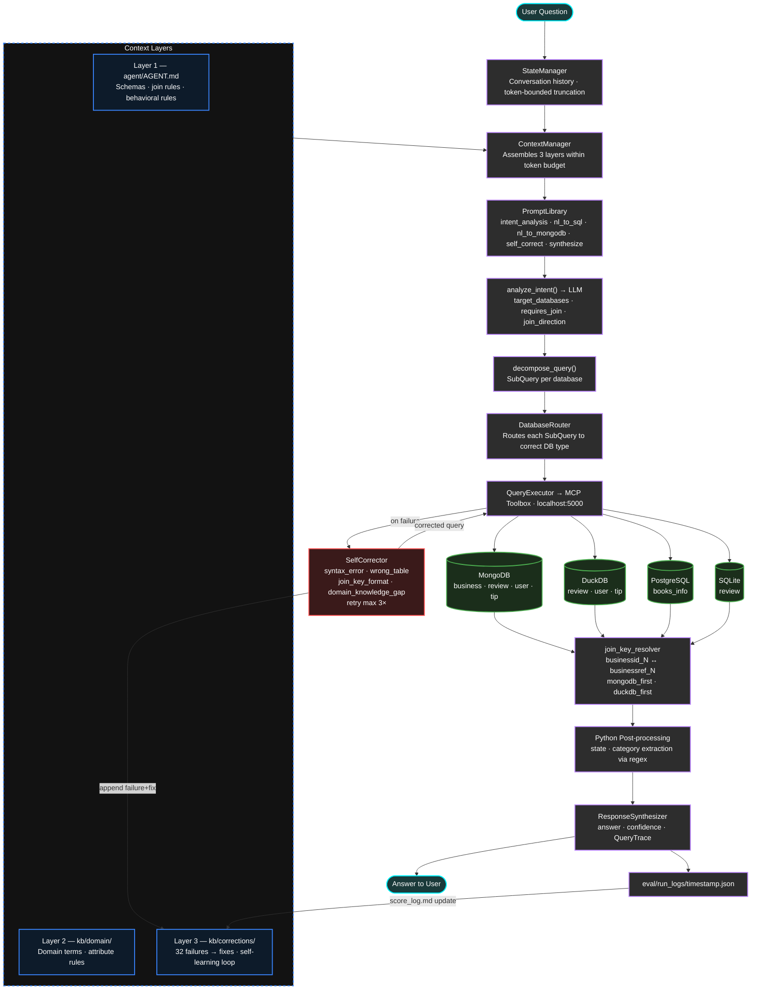

# Oracle Forge — Team Falcon

**The Oracle Forge of Data Agent** | TRP1 FDE Programme | Week 8–9 | April 2026

**Live agent (shared server):** `http://<VPS_IP>:8000` — update with actual IP before submission

---

## Team

| Name | Role |
|------|------|
| Natnael Alemseged | Driver 2 — Agent Logic & Context Engineering |
| Yakob Dereje | Driver 1 — Infrastructure & DB Connections |
| Mamaru Yirga | Intelligence Officer |
| Ramlla Akmel | Intelligence Officer |
| Melaku Yilma | Signal Corps |
| Rahel Samson | Signal Corps |

---

## Architecture

The agent answers natural language questions by routing sub-queries across 4 database types, merging results, and producing a verifiable answer with a full query trace.



**Two join strategies:**
- `mongodb_first` — filter by MongoDB attributes/location → lookup DuckDB reviews
- `duckdb_first` — filter by DuckDB time/user → lookup MongoDB business names

---

## Repo Structure

```
oracle-forge/
├── agent/                       # Core agent (Driver 2)
│   ├── AGENT.md                 # Context Layer 1: schemas, join rules, behavioral rules
│   ├── agent_core.py            # Main orchestration loop (5-step pipeline)
│   ├── prompt_library.py        # All LLM prompts (intent, NL→SQL, NL→MongoDB, self-correct)
│   ├── context_manager.py       # Assembles 3-layer KB within token budget
│   ├── self_corrector.py        # Diagnose + retry (4 failure types, max 3 attempts)
│   ├── response_synthesizer.py  # Merges DB results → narrative answer
│   ├── database_router.py       # Routes queries to correct DB type
│   ├── query_executor.py        # MCP Toolbox JSON-RPC calls
│   ├── state_manager.py         # Conversation history (token-bounded)
│   ├── llm_client.py            # OpenRouter interface (gemini-2.0-flash-001)
│   └── models.py                # Pydantic contracts (QueryRequest, SubQuery, AgentResponse)
│
├── kb/                          # LLM Knowledge Base (Intelligence Officers)
│   ├── architecture/            # KB v1: system design patterns
│   │   ├── self_correction_loop.md
│   │   ├── dab_failure_modes.md
│   │   ├── claude_code_memory.md
│   │   ├── openai_data_agent_context.md
│   │   ├── tool_scoping_and_parallelism.md
│   │   ├── autodream_consolidation.md
│   │   ├── agent_probing_strategy.md
│   │   ├── ddb_failure_modes.md
│   │   ├── injection_tests.md   ← verified injection test evidence
│   │   └── CHANGELOG.md
│   ├── domain/                  # KB v2: dataset schemas + domain knowledge
│   │   ├── yelp_schema.md
│   │   ├── schema_overview.md
│   │   ├── join_keys_glossary.md
│   │   ├── unstructured_fields_inventory.md
│   │   ├── domain_knowledge.md
│   │   ├── domain_terms.md
│   │   ├── injection_tests.md   ← verified injection test evidence
│   │   └── CHANGELOG.md
│   ├── evaluation/              # KB v3 (evaluation): DAB scoring method
│   │   ├── dab_read.md
│   │   ├── ddb_read.md
│   │   ├── scoring_method.md
│   │   ├── injection_tests.md   ← verified injection test evidence
│   │   └── CHANGELOG.md
│   └── corrections/             # KB v3 (corrections): 32 failure entries
│       ├── corrections_log.md
│       ├── injection_tests.md   ← verified injection test evidence
│       └── CHANGELOG.md
│
├── api/                         # Public HTTP API
│   └── server.py                # FastAPI app — POST /query, GET /health, GET /datasets
│
├── mcp/                         # MCP Toolbox (Driver 1)
│   ├── mcp_server.py            # FastAPI MCP server (6 tools, JSON-RPC 2.0)
│   └── tools.yaml               # Tool definitions for all 4 DB types
│
├── eval/                        # Evaluation harness (Drivers)
│   ├── run_benchmark.py         # Full DAB benchmark runner (54 queries, 5 trials)
│   ├── run_query.py             # Single-query test runner
│   ├── score.py                 # Computes pass@1 from results JSON
│   ├── score_log.md             # Score progression: 0% → 100% on Yelp (25 runs)
│   └── run_logs/                # Timestamped per-run JSON logs (200+ entries)
│
├── utils/                       # Shared utility modules (Intelligence Officers)
│   ├── join_key_resolver.py     # Cross-DB ID format resolution (businessid_N ↔ businessref_N)
│   ├── schema_introspector.py   # Unified schema introspection across all 4 DB types
│   ├── multi_pass_retrieval.py  # Vocabulary-expanded KB retrieval
│   ├── benchmark_harness_wrapper.py  # Evaluation wrapper with trace logging
│   └── README.md
│
├── probes/                      # Adversarial probe library (Intelligence Officers)
│   └── probes.md                # 15 probes across all 4 DAB failure categories
│
├── planning/                    # AI-DLC sprint documents (Drivers)
│   ├── inception_v1.md          # Sprint 1 Inception — team-approved April 9, 2026
│   └── sprint_plan_driver2.md
│
├── signal/                      # Signal Corps
│   ├── engagement_log.md              # Original posts, X threads, resource acquisitions
│   └── community_participation_log.md # Reddit/Discord/X replies and community comments
│
├── requirements.txt
└── README.md
```

---

## Knowledge Base

The KB is the agent's persistent context, built using the Karpathy method: minimal, precise documents injected directly into the LLM context window. Every document is verified by an injection test before committing (see `injection_tests.md` in each subdirectory).

| Layer | Location | Contents |
|-------|----------|----------|
| Architecture (v1) | `kb/architecture/` | Claude Code memory system, OpenAI 6-layer context design, self-correction loop, tool scoping, DuckDB/DAB failure modes |
| Domain (v2) | `kb/domain/` | Yelp dataset schema, join key format glossary, unstructured field inventory, domain term definitions |
| Evaluation (v3) | `kb/evaluation/` | DAB scoring method, pass@1 definition, submission format |
| Corrections (v3) | `kb/corrections/` | 32 observed agent failures → root cause → correct approach. Read by agent at session start. |

The master context file loaded at every session start is [`agent/AGENT.md`](agent/AGENT.md).

---

## Score Progression

| Date | Queries Passed | pass@1 | Notes |
|------|---------------|--------|-------|
| 2026-04-11 | 0/7 | 0% | Baseline — code fence + pipeline string errors |
| 2026-04-11 | 1/7 | 14% | Pattern A fix (no code fences in SQL) |
| 2026-04-14 | 4/7 | 57% | Pattern B + C fixes (pipeline format, DuckDB table boundaries) |
| 2026-04-14 | 6/7 | 86% | Pattern D fix (mixed date format handling) |
| 2026-04-14 | 7/7 | 100% | Python post-processing for state/category extraction |

Full run history in [`eval/score_log.md`](eval/score_log.md).

---

## Public Query API

A lightweight HTTP API lets anyone submit natural-language questions to the agent without running the CLI.

**Start the API server:**
```bash
source .venv/bin/activate && source .env
uvicorn api.server:app --port 8080
```

**Expose publicly via Cloudflare Tunnel** (no account needed):
```bash
cloudflared tunnel --url http://localhost:8080
# Prints a URL like: https://random-words.trycloudflare.com
```

Current demo endpoint (temporary quick tunnel, may change on restart):  
`https://subjective-heading-powers-hiking.trycloudflare.com`

**Endpoints:**

| Method | Path | Description |
|--------|------|-------------|
| `GET` | `/health` | Liveness check |
| `GET` | `/datasets` | List valid dataset names |
| `POST` | `/query` | Submit a question |

**Example request:**
```bash
curl -X POST https://<tunnel-url>/query \
  -H "Content-Type: application/json" \
  -d '{"question": "What are the top 5 rated businesses?", "dataset": "yelp"}'
```

**Alternative request format (Swagger-style):**
```bash
curl -X 'POST' \
  'https://<tunnel-url>/query' \
  -H 'accept: application/json' \
  -H 'Content-Type: application/json' \
  -d '{
  "question": "What is the average rating of all businesses located in Indianapolis, Indiana?",
  "dataset": "yelp",
  "session_id": "string"
}'
```

**Example response:**
```json
{
  "answer": "The top 5 rated businesses are...",
  "session_id": "abc123",
  "dataset": "yelp",
  "confidence": 0.9
}
```

Interactive API docs available at `http://localhost:8080/docs`.

---

## Benchmark

- Dataset: [UC Berkeley DataAgentBench](https://github.com/ucbepic/DataAgentBench) — 54 queries, 12 datasets, 4 DB types
- Current SOTA: PromptQL + Gemini at 54.3% pass@1
- Evaluation: `python eval/run_benchmark.py --dataset yelp --trials 5`

---

## Setup (fresh machine)

```bash
# 1. Clone
git clone https://github.com/Natnael-Alemseged/oracle-forge.git
cd oracle-forge

# 2. Create .env (never commit)
cat > .env << 'EOF'
OPENROUTER_API_KEY=...
POSTGRES_USER=oracle_forge
POSTGRES_PASSWORD=...
POSTGRES_HOST=127.0.0.1
POSTGRES_DB=yelp
MONGO_HOST=127.0.0.1
MONGO_PORT=27017
MONGO_DB=yelp_db
SQLITE_PATH=db/dab_sqlite.db
DUCKDB_PATH=db/yelp_user.db
# Bookreview dataset
POSTGRES_DB_BOOKREVIEW=bookreview_db
SQLITE_PATH_BOOKREVIEW=DataAgentBench/dataset/bookreview/review_query.db
EOF

# 3. Install dependencies
pip install -r requirements.txt

# 4. Load DAB datasets
git clone https://github.com/ucbepic/DataAgentBench.git
cd DataAgentBench && bash setup/load_postgres.sh && cd ..

# 4b. Load Bookreview dataset (PostgreSQL + SQLite)
# PostgreSQL: books_database / bookreview_db with table books_info (~200 books)
psql -U postgres -c "CREATE DATABASE bookreview_db;" 2>/dev/null || true
psql -U postgres -d bookreview_db -c "\dt" | grep -q books_info || \
  psql -U postgres -d bookreview_db -c "\i DataAgentBench/dataset/bookreview/books_schema.sql"
psql -U postgres -d bookreview_db -c "\i DataAgentBench/dataset/bookreview/books_data.sql"

# SQLite: review_database / review_query.db with table review (book reviews)
sqlite3 DataAgentBench/dataset/bookreview/review_query.db ".tables" | grep -q review || \
  sqlite3 DataAgentBench/dataset/bookreview/review_query.db < DataAgentBench/dataset/bookreview/review_schema.sql
sqlite3 DataAgentBench/dataset/bookreview/review_query.db < DataAgentBench/dataset/bookreview/review_data.sql

# Note: Update mcp/tools.yaml with actual paths:
# - postgres_query: host=127.0.0.1, port=5432, database=bookreview_db
# - sqlite_query: path=DataAgentBench/dataset/bookreview/review_query.db

# 5. Start MCP server
python mcp/mcp_server.py &
# Server runs on http://localhost:5000

# 6. Verify all tools accessible
curl http://localhost:5000/v1/tools | python3 -m json.tool | grep name

# 7. Run a single test query
python eval/run_query.py --question "What is the average rating of businesses in Las Vegas?"

# 8. Run full benchmark 
# 8a. Run Yelp benchmark

python eval/run_benchmark.py --dataset yelp --trials 5

# 8b. Run Bookreview benchmark
python eval/run_benchmark.py --dataset bookreview --trials 3
```

## Running a Different Dataset (Bookreview Example)

The agent supports multiple DAB datasets. Here's how to switch to `bookreview` (PostgreSQL + SQLite).

### 1. Update `.env`

```bash
# Switch PostgreSQL to bookreview_db
POSTGRES_DB=bookreview_db

# Point SQLite to the bookreview review database
SQLITE_PATH=/absolute/path/to/oracle-forge/DataAgentBench/query_bookreview/query_dataset/review_query.db
```

### 2. Load the bookreview PostgreSQL database (one-time)

```bash
# Create the database (run as postgres superuser)
sudo -u postgres psql -c "CREATE DATABASE bookreview_db OWNER oracle_forge;"

# Load the schema and data
PGPASSWORD=<your_password> psql -h 127.0.0.1 -U oracle_forge -d bookreview_db \
  -f DataAgentBench/query_bookreview/query_dataset/books_info.sql
```

The SQLite file (`review_query.db`) is already included in the DataAgentBench clone — no extra loading needed.

### 3. Restart the MCP server

```bash
# Kill any running instance
fuser -k 5000/tcp

# Restart with updated .env
set -a && source .env && set +a
uvicorn mcp.mcp_server:app --port 5000
```

### 4. Run the benchmark

```bash
python eval/run_benchmark.py --dataset bookreview --trials 3
```

### Switching back to Yelp

```bash
# In .env, restore:
POSTGRES_DB=yelp
SQLITE_PATH=/absolute/path/to/oracle-forge/DataAgentBench/query_yelp/query_dataset/yelp_user.db
# (or leave SQLITE_PATH pointing to data/dab_sqlite.db if not using Yelp SQLite)
```

Then restart the MCP server.

---

## Running the CRMArena Pro Dataset

CRMArena Pro uses 6 databases across 3 DB types (SQLite × 3, DuckDB × 2, PostgreSQL × 1). The file-based DBs are read directly from the DataAgentBench clone — no extra loading needed. Only the PostgreSQL `support` database requires a one-time setup.

### 1. Add to `.env`

```bash
CRM_SUPPORT_POSTGRES_DB=crm_support
```

### 2. Load the support PostgreSQL database (one-time)

```bash
# Create the database (requires sudo)
sudo -u postgres psql -c "CREATE DATABASE crm_support OWNER oracle_forge;"

# Load the schema and data
PGPASSWORD=<your_password> psql -h 127.0.0.1 -U oracle_forge -d crm_support \
  -f DataAgentBench/query_crmarenapro/query_dataset/support.sql
```

### 3. Restart the MCP server

```bash
fuser -k 5000/tcp
source .venv/bin/activate && uvicorn mcp.mcp_server:app --port 5000
```

### 4. Run the benchmark

```bash
PYTHONPATH=/path/to/oracle-forge python eval/run_benchmark.py --dataset crmarenapro --trials 1
```

The agent automatically resolves the 6 logical DB names (`core_crm`, `sales_pipeline`, `support`, `products_orders`, `activities`, `territory`) to their correct file paths from `CRM_DB_MAP` in `agent/agent_core.py`. No `.env` changes needed for the file-based DBs — paths are derived from `DAB_ROOT`.

---

## Running the PANCANCER_ATLAS Dataset

PANCANCER_ATLAS uses PostgreSQL (clinical data) + DuckDB (molecular/genomic data).

### 1. Add to `.env`

```bash
PANCANCER_POSTGRES_DB=pancancer_clinical
```

### 2. Load the clinical PostgreSQL database (one-time)

```bash
sudo -u postgres psql -c "CREATE DATABASE pancancer_clinical OWNER oracle_forge;"
PGPASSWORD=<your_password> psql -h 127.0.0.1 -U oracle_forge -d pancancer_clinical \
  -f DataAgentBench/query_PANCANCER_ATLAS/query_dataset/pancancer_clinical.sql
```

### 3. Download the molecular DuckDB file (one-time, ~280MB via Git LFS)

```bash
cd DataAgentBench && git lfs pull --include="query_PANCANCER_ATLAS/query_dataset/pancancer_molecular.db"
```

### 4. Restart the MCP server

```bash
fuser -k 5000/tcp
source .venv/bin/activate && uvicorn mcp.mcp_server:app --host 127.0.0.1 --port 5000
```

### 5. Run the benchmark

```bash
export PYTHONPATH=.:DataAgentBench
python eval/run_benchmark.py --dataset PANCANCER_ATLAS --trials 1
```

---


| Module | What it does |
|--------|-------------|
| `join_key_resolver.py` | Converts IDs between DB formats (e.g. `businessid_42` → `businessref_42`) |
| `schema_introspector.py` | Single interface to introspect schema across all 4 DB types |
| `multi_pass_retrieval.py` | Runs multiple vocabulary passes against KB to catch edge-case corrections |
| `benchmark_harness_wrapper.py` | Wraps DAB evaluation with per-query trace logging and score output |

---

## Adversarial Probes

[`probes/probes.md`](probes/probes.md) — 15 probes covering all 4 DAB failure categories:
- Multi-database routing failures
- Ill-formatted join key mismatches
- Unstructured text extraction failures
- Domain knowledge gaps

Each probe documents: query, expected failure, observed failure, fix applied, post-fix score.